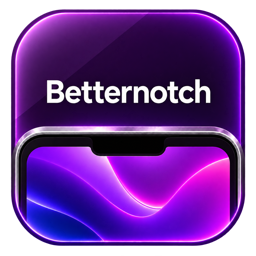

# BetterNotch



A compact macOS shelf that expands from the camera notch when you touch it with the pointer.

## Features

- Temporary file and folder shelf with drag-and-drop and AirDrop.
- Music controls for Apple Music or Spotify, with optional Safari, Chrome, and Firefox media.
- Quick notes and a compact monthly calendar inside the notch.
- Optional local temperature.
- Independent section toggles, animation controls, and adjustable activation and closing distances.
- Categorized settings and a Permissions page with connection checks.

The closed panel is invisible by default. Files, Music, Calendar, and Notes stack in that order; hiding a section moves the others up. Notes and file references are temporary and are cleared when the app quits.

## Build and run

Requires macOS 13 or later and Xcode with the macOS SDK. Open `BetterNotch.xcodeproj`, select the BetterNotch scheme and My Mac, then run.

```sh
xcodebuild -project BetterNotch.xcodeproj \
  -scheme BetterNotch -configuration Release \
  -derivedDataPath /tmp/BetterNotchBuild CODE_SIGN_IDENTITY=- build
```

The app uses AppKit and SwiftUI without third-party runtime dependencies. Local builds are ad-hoc signed. Developer ID signing and notarization are not configured.

BetterNotch hides its Dock icon and requests start at login by default. Open settings using the notch gear or menu bar. Keep the app in a permanent location for login launch. Hide from Dock, Hide from menu bar, and Start at login can be changed independently.

## Files and notes

Drag local files or folders from Finder onto the shelf. There is no app-imposed file size or type limit: the shelf keeps references instead of copying file contents. A successful external drop removes the reference; cancelled drops and drops back onto the shelf retain it. Removing a reference never deletes the original.

Double-click a file to open it, or right-click for additional actions. Moving or deleting the original can invalidate its reference. Browser links and promised files are not imported.

Drop a file onto AirDrop to open the macOS recipient chooser. AirDrop availability and transfer behavior are controlled by macOS.

The pencil button toggles Notes without creating a note. Use plus to add one and minus to delete the selected note. A normal quit asks for confirmation if notes contain text. Force Quit, crashes, and power loss cannot preserve temporary notes.

## Music and browser setup

Choose Apple Music or Spotify under **Settings → Music & Audio**. **Include browser audio** is off by default. When enabled, playing browser media takes priority over the selected music app. BetterNotch displays one media item at a time.

Use **Settings → Permissions** to connect apps and diagnose missing access:

| Source | Setup |
| --- | --- |
| Apple Music / Spotify | Click Connect / Retry and approve macOS Automation access. |
| Safari | Allow Automation and enable Develop → Allow JavaScript from Apple Events. |
| Chrome | Allow Automation and enable View → Developer → Allow JavaScript from Apple Events. |
| Firefox | Load and pair the companion extension using the [Firefox setup guide](FirefoxExtension/README.md). |

Firefox's development extension must be loaded again after restarting Firefox. Permanent installation in standard Firefox requires a Mozilla-signed extension; this project does not include one.

Browser support covers accessible HTML audio/video, including many YouTube videos. Play/pause is supported; browser next/previous controls are offered when YouTube provides those buttons. System sounds, arbitrary application audio, Web Audio without HTML media elements, and some protected or embedded media are not supported. Up to 40 tabs are inspected per browser. Media collection pauses when the music section is inactive; the Firefox extension continues lightweight local connection checks while loaded.

## Appearance and behavior

Touch the physical notch to open the panel. Opening deadzone defaults to zero; increase it to activate from farther away. The closing distance defaults to approximately 1.5 mm and is configured separately.

Expand, Fade, and Instant can be selected independently for opening and closing. Expand grows the entire panel from the notch. Reduce Motion disables animations. The panel uses the notched display when available, otherwise the top center of the main display.

## Privacy

- No analytics or app-generated activity logs.
- File references, note contents, media metadata, artwork, and weather stay in memory.
- Preferences and a randomly generated Firefox pairing key are saved locally. Keep the pairing key private.
- Firefox communicates with the app through an authenticated connection bound to `127.0.0.1:49327`. Its extension excludes private windows. Safari and Chrome inspect accessible tabs through Automation; disable browser audio when those tabs should not be inspected.
- Optional weather sends coordinates rounded to two decimal places to [Open-Meteo](https://open-meteo.com/). Artwork requests contact the URL provided by the media source. These services receive normal network request information, including the IP address.
- Weather and artwork use ephemeral network sessions without a disk cache. The app does not record audio or save browsing history.

The calendar is a local month view; it does not access calendar accounts or events.

## Verification

See [TESTING.md](TESTING.md) for automated checks and the remaining manual acceptance tests.
